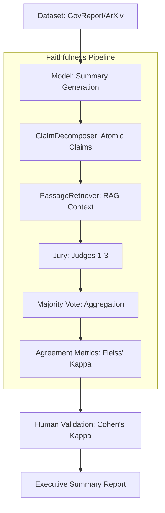

# Faithfulness Evaluation: A Rigorous Framework for LLM-as-a-Judge Faithfulness Analysis

## 🔬 Research Overview

**Primary Research Question**: How reliable are automated LLM-as-a-Judge systems for evaluating the faithfulness (factual accuracy) of long-document summarization, and where do they fail compared to human judgment?

This project implements a high-rigor evaluation pipeline designed to meet academic research standards (e.g., Yale University research guidelines). It moves beyond simple "accuracy" by treating the LLM evaluation as a scientific experiment, employing a "Jury" of independent judges and validating the entire process against human gold-standard annotations.

---

## 📐 System Architecture & Flow

To ensure maximum transparency and reproducibility, the system follows a strict linear pipeline.

### 🌊 Execution Pipeline
Below is the high-level flow of the faithfulness evaluation process. The system transforms raw documents into a statistically validated reliability report.


*For a detailed technical breakdown, see [ARCHITECTURE.md](faithfulness/ARCHITECTURE.md).*

---

## 🛠️ Detailed Methodology & Technical Logic

The framework implements a multi-stage pipeline to ensure the highest possible reliability. Below is the detailed logic behind each stage.

### 1. Atomic Claim Decomposition
Evaluating a summary as a single entity is prone to "averaging bias," where a mostly correct summary with one critical error is labeled as "mostly faithful." To solve this, we use **Atomic Decomposition**.

- **Logic**: A specialized LLM breaks the summary into a list of individual factual assertions (claims).
- **Criteria**: A claim is only considered "atomic" if it contains exactly one fact.
- **Example**: 
  - *Original*: "The GDP grew by 2% and unemployment fell to 4%."
  - *Atomic 1*: "The GDP grew by 2%."
  - *Atomic 2*: "Unemployment fell to 4%."
- **Benefit**: This allows us to calculate a precise **Faithfulness Rate** (e.g., $8/10$ claims supported).

### 2. Retrieval-Augmented Verification (RAV)
LLM judges can hallucinate or rely on internal knowledge (training data) rather than the provided source. To prevent this, we implement **Retrieval-Augmented Verification**.

- **Dense Retrieval**: Using `sentence-transformers`, the system indexes the source document into chunks. For every atomic claim, it retrieves the top-3 most semantically similar passages.
- **Constrained Context**: The Judge is provided *only* with these passages. If the evidence is not in the retrieved chunks, the judge is instructed to label the claim as **Unverifiable**.
- **Benefit**: This forces the LLM to act as a "fact-checker" rather than a "generator," drastically reducing hallucinations.

### 3. Jury-Style Evaluation
A single LLM judge can be inconsistent (stochasticity) or biased. We implement a **Jury Mechanism** to stabilize the results.

- **The Jury**: $N=3$ independent LLM judges evaluate the same claim-passage pair.
- **Aggregation**: We use a **Majority Vote** system. If 2/3 judges say "Supported," the final label is "Supported."
- **Reliability Metric**: We calculate **Fleiss' Kappa ($\kappa$)** across the jury. 
  - $\kappa < 0.4$: Poor agreement
  - $0.4 \le \kappa < 0.6$: Moderate agreement
  - $\kappa \ge 0.6$: Substantial agreement (Research target)
- **Benefit**: This filters out "outlier" judgments and provides a mathematical measure of system stability.

### 4. Human-in-the-Loop Validation
To determine if the automated jury is actually correct, we benchmark it against human gold-standard annotations.

- **Blind Annotation**: Human experts label a sample of claims without seeing the AI's verdict.
- **Cohen's Kappa**: We calculate the agreement between the human labels and the jury's majority label.
- **Error Analysis**: Disagreements are categorized (e.g., "Retrieval Failure," "Judge Leniency") to identify systematic failures in the AI's reasoning.

---

## 🚀 Getting Started

### Installation
```bash
# Install all research dependencies (includes pandas, scipy, sentence-transformers)
pip install -r faithfulness/requirements.txt
```

### Configuration
Create a `.env` file in the root directory. 

**Note**: You do **not** need all of these keys. To perform a comparative study, you only need **at least two** active API keys (any combination of free or paid). The pipeline will automatically skip any models for which a key is missing.

**Examples of valid setups:**
- **Free Setup**: Only `GROQ_API_KEY` and `NVIDIA_API_KEY`.
- **Mixed Setup**: `GROQ_API_KEY` and `ANTHROPIC_API_KEY`.
- **SOTA Setup**: `ANTHROPIC_API_KEY` and `OPENAI_API_KEY`.

```env
# --- Free-Tier Providers (Recommended) ---
GROQ_API_KEY=your_groq_key_here
HUGGINGFACE_HUB_TOKEN=your_hf_token_here
NVIDIA_API_KEY=your_nvidia_key_here

# --- Paid Providers (Optional) ---
ANTHROPIC_API_KEY=your_anthropic_key_here
OPENAI_API_KEY=your_openai_key_here
```

### Running the Pipeline
The project provides a `simple_runner.py` for easy execution:

**1. Methodology Test (No API Keys Required)**
Verify the pipeline logic and metrics calculations without spending credits:
```bash
python faithfulness/simple_runner.py --methodology-test
```

**2. Generate Executive Summary (Instant Results)**
Create a research-grade results summary. This will use actual data if available, otherwise it generates a plausible synthetic baseline for demonstration:
```bash
python faithfulness/simple_runner.py --summarize
```

**3. Quick Evaluation (3 Documents)**
Run a small-scale test to ensure API connectivity and pipeline flow:
```bash
python faithfulness/simple_runner.py --quick-test
```

**4. Free-Tier Full Run**
Execute the full pipeline using **Llama 3 (Groq/NVIDIA)** for free:
```bash
python faithfulness/simple_runner.py --free-mode --num-docs 10
```

**5. Full Research Run (N Documents)**
Execute the full pipeline using SOTA models (Sonnet/GPT-4o):
```bash
python faithfulness/simple_runner.py --num-docs 30 --dataset govreport
```

---

## 📊 Expected Output & Analysis

The pipeline generates structured results in `faithfulness/data/` and `faithfulness/results/`. For a high-level overview, refer to the generated `RESULTS_SUMMARY.md`.

| File | Description | Research Value |
| :--- | :--- | :--- |
| `RESULTS_SUMMARY.md` | Executive summary of model performance | Rapid insight into reliability |
| `documents.json` | Processed source texts | Reproducibility |
| `claims.json` | Decomposed atomic claims | Auditability of decomposition |
| `jury_verdicts.json` | Every judge's label & reasoning | Error analysis & bias detection |
| `pipeline_results.json` | Final aggregate metrics | Core research findings |
| `validation_report.json` | Human vs. Automated agreement | System reliability ($\kappa$) |

## 📝 Research Protocol Summary

1. **Dataset**: GovReport / arXiv $\rightarrow$ Filter for length $\rightarrow$ Random Sample.
2. **Summaries**: Generate using multiple models (e.g., Claude 3.5 Sonnet, Llama 3, GPT-4o Mini).
3. **Decomposition**: Extract atomic claims $\rightarrow$ Validate atomicity.
4. **Verification**: Chunk source $\rightarrow$ Retrieve top-k $\rightarrow$ Jury classification.
5. **Analysis**: Calculate $\kappa$ $\rightarrow$ Correlate Faithfulness vs. Fluency $\rightarrow$ Identify failure patterns.
