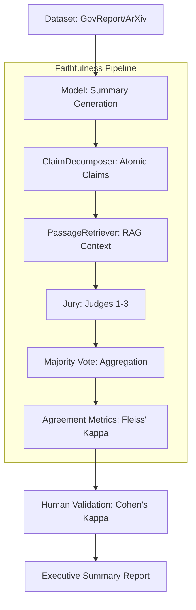

# Faithfulness Pipeline Architecture

## 📐 System Overview

The Faithfulness Evaluation system is designed as a rigorous, multi-stage pipeline to quantify the factual accuracy of LLM-generated summaries. Unlike simple similarity metrics, this system employs a **Retrieval-Augmented Jury (RAJ)** approach to ensure every claim is verified against source evidence.

### 🌊 Execution Flow

---

## 🧩 Component Deep Dive

### 1. Atomic Claim Decomposition
To avoid the "averaging effect" of long summaries, we decompose summaries into **Atomic Claims**. A claim is atomic if it contains exactly one factual assertion.
- **Validation**: Every claim is checked for vagueness or compound logic.

### 2. Retrieval-Augmented Verification (RAV)
To eliminate LLM hallucination during judgment, we use **Dense Retrieval** (`sentence-transformers`). For every atomic claim, we retrieve the top-3 most relevant passages from the original source document, creating a constrained context for the judge.

### 3. The Jury Mechanism
To mitigate the stochastic nature of LLMs, we employ a **Jury of 3 independent judges**.
- **Independence**: Each judge evaluates the claim and the retrieved passages separately.
- **Aggregation**: The final label (**Supported**, **Contradicted**, or **Unverifiable**) is determined by a majority vote.
- **Consistency**: We measure the "stability" of the jury using **Fleiss' Kappa ($\kappa$)**.

---

## 🎯 Research Benchmarks (KPIs)

To qualify as a reliable evaluation system, the project targets the following performance thresholds:

| Metric | Target | Interpretation |
| :--- | :---: | :--- |
| **Inter-Judge Agreement** | $\kappa > 0.60$ | Substantial agreement among LLM judges. |
| **Human-Auto Alignment** | $\kappa > 0.60$ | Automated system is a reliable proxy for human experts. |
| **Position Bias Rate** | $< 5\%$ | Minimal sensitivity to the order of retrieved passages. |
| **Faithfulness Rate** | $> 75\%$ | Baseline accuracy for state-of-the-art models (e.g., Sonnet). |

## 📂 Output Schema

The system produces a fully auditable trail of evidence:
- `documents.json`: The original source.
- `claims.json`: The broken-down factual assertions.
- `jury_verdicts.json`: The raw reasoning and labels from every judge.
- `pipeline_results.json`: The final statistical summary.
