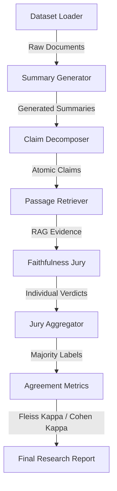

# 🏛️ Faithfulness Evaluation Framework: Technical Architecture

This document describes the methodological and technical blueprint of the Faithfulness Evaluation project. The system is designed to objectively measure the factual reliability of LLM-generated summaries compared to their source documents.

## 🛠️ High-Level System Flow

The pipeline follows a strict 7-stage process to ensure a reproducible and scientifically sound evaluation.

## 🔬 Methodological Breakdown

### 1. Atomic Claim Decomposition
To avoid the ambiguity of evaluating a whole summary, the system breaks summaries into **Atomic Claims**. 
- **Rule**: Each claim must be a single, verifiable factual assertion.
- **Process**: A high-capability LLM (e.g., Llama 3 70B) is used to decompose sentences into non-overlapping facts.

### 2. Retrieval-Augmented Verification (RAV)
Instead of passing the entire source document to the judge (which introduces "lost-in-the-middle" noise), we use a RAG approach:
- **Dense Retrieval**: Uses `sentence-transformers` to find the top-K most relevant passages for each specific claim.
- **TF-IDF Fallback**: Ensures the system remains operational on environments where PyTorch DLLs fail.

### 3. The LLM Jury Model
To eliminate the bias of a single model, we implement a **Jury System**:
- **Diverse Perspectives**: Multiple models (the "Jury") independently evaluate the same claim.
- **Verdict Labels**: Each judge must assign one of three labels:
    - `Supported`: Directly stated or clearly implied.
    - `Contradicted`: Directly conflicts with the source.
    - `Unverifiable`: Insufficient information in the source.

### 4. Statistical Reliability Metrics
The system doesn't just report "faithfulness"; it reports the **reliability of the measurement itself**.

- **Fleiss' Kappa ($\kappa$)**: Measures the degree of agreement among the jury members. 
    - $\kappa < 0.4$: Poor agreement
    - $0.4 \le \kappa < 0.6$: Moderate agreement
    - $\kappa \ge 0.6$: Substantial agreement
- **Confidence Score**: Derived from the label distribution (e.g., 3/3 agreement = High Confidence).

## 🚀 Technical Stack

| Component | Technology | Purpose |
| :--- | :--- | :--- |
| **Inference** | Groq / NVIDIA NIM | Low-latency, free-tier access to Llama 3 / Mixtral |
| **Embeddings** | Sentence-Transformers | Dense vector search for evidence retrieval |
| **Logic** | Python 3.11 | Core orchestration and statistical analysis |
| **Data** | JSON / Markdown | Transparent, human-readable results |

## 🎯 Research KPIs
The framework aims to optimize for:
1. **High Inter-rater Reliability**: Target $\kappa > 0.6$ for all evaluations.
2. **Zero-Cost Execution**: Ability to run full-scale evaluations using free-tier API keys.
3. **Evidence Transparency**: Every verdict is backed by a specific retrieved passage from the source.
